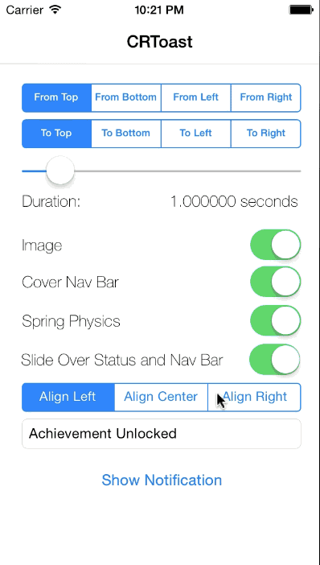
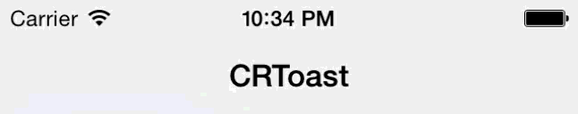

# CWStatusBarNotification

`CWStatusBarNotification` is a library that allows you to easily create notifications that appear on the status bar.



## Requirements

`CWStatusBarNotification` uses ARC and requires iOS 7.0+. Works for iPhone and iPad.

## Installation

### CocoaPods

`pod 'CWStatusBarNotification', '~> 3.0'`

### Manual

Copy the folder `CWStatusBarNotification` to your project.

## Usage

Notifications can be created through `CWStatusBarNotificationManager`'s `showNotificationWithOptions:completionBlock:` This will queue up a notification with the options specified. You provide options for your notification in a dictionary using the keys in `CWStatusBarNotification.h`

#### Example
This code

```	objc
NSDictionary *options = @{kCWStatusBarNotificationTextKey : @"Hello World!",
                          kCWStatusBarNotificationTextAlignmentKey : @(NSTextAlignmentCenter),
                          kCWStatusBarNotificationBackgroundColorKey : [UIColor redColor],
                          kCWStatusBarNotificationAnimationTypeKey : @(CWStatusBarNotificationAnimationTypeSpring),
                          kCWStatusBarNotificationAnimationInStyleKey : @(CWStatusBarNotificationAnimationStyleLeft),
                          kCWStatusBarNotificationAnimationOutStyleKey : @(CWStatusBarNotificationAnimationStyleRight),
                          kCWStatusBarNotificationAnimationInTimeIntervalKey : @(0.5),
                          kCWStatusBarNotificationAnimationOutTimeIntervalKey: @(0.5)};
    [CWStatusBarNotificationManager showNotificationWithOptions:options
                                                completionBlock:^{
                                                    NSLog(@"Completed");
                                                }];
```
Generates this




## Customization

`CWStatusBarNotification` is very customizable. Taking a hint from `UIStringDrawing`'s `drawInRect:withAttributes:` book, notifications are created with dictionaries filled with all their options.

### Customizing Appearance

`CWStatusBarNotification` allows for setting of

- Alert Text
- Text Color
- Text Font
- Text Alignment
- Text Color
- Text Shadow Color
- Text Shadow Offset
- Left aligned image

### Customizing Animation

`CWStatusBarNotification` also allows for animation customization. This includes.

- Animation Type (Linear or Spring)
- Presentation Type (Slide over bars or push content out)
- Direction (Enter and exit in any direction)
- Enter, Stay on Screen and Exit Timing

### Setting Defaults

There are sane defaults set for all properties, however you can set a default set of options for your application's notifications using `CWStatusBarNotificationManagers`'s `setDefaultOptions:`.

## License

    The MIT License (MIT)

    Copyright (c) 2013 Cezary Wojcik <http://www.cezarywojcik.com>

    Permission is hereby granted, free of charge, to any person obtaining a copy
    of this software and associated documentation files (the "Software"), to deal
    in the Software without restriction, including without limitation the rights
    to use, copy, modify, merge, publish, distribute, sublicense, and/or sell
    copies of the Software, and to permit persons to whom the Software is
    furnished to do so, subject to the following conditions:

    The above copyright notice and this permission notice shall be included in
    all copies or substantial portions of the Software.

    THE SOFTWARE IS PROVIDED "AS IS", WITHOUT WARRANTY OF ANY KIND, EXPRESS OR
    IMPLIED, INCLUDING BUT NOT LIMITED TO THE WARRANTIES OF MERCHANTABILITY,
    FITNESS FOR A PARTICULAR PURPOSE AND NONINFRINGEMENT. IN NO EVENT SHALL THE
    AUTHORS OR COPYRIGHT HOLDERS BE LIABLE FOR ANY CLAIM, DAMAGES OR OTHER
    LIABILITY, WHETHER IN AN ACTION OF CONTRACT, TORT OR OTHERWISE, ARISING FROM,
    OUT OF OR IN CONNECTION WITH THE SOFTWARE OR THE USE OR OTHER DEALINGS IN
    THE SOFTWARE.