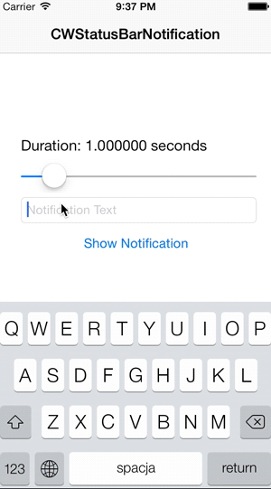

# CWStatusBarNotification

`CSStatusBarNotification` is a category on UIViewController that allows you to easily create text-based notifications that appear on the status bar.

## Requirements

CWStatsBarNotification uses ARC and requires iOS 6.0+.

Works for iPhone and iPad.

## Installation

### CocoaPods

`pod 'CWStatusBarNotification', '~> 1.1.0'`

### Manual

Copy the folder `CWStatusBarNotification` to your project.

## Usage

Use the following import statement in the View Controller you wish to use this with:

    #import "UIViewController+CWStatusBarNotification.h"

Now, to trigger a notification:

    NSString *notificationText = @"This is a test notification";
    CGFloat duration = 1.0f;
    [self showStatusBarNotification:notificationText forDuration:duration];

### Customization

The category adds a new property to `UIViewController` called `statusBarNotificationLabel`. Here is an example usage:

    self.statusBarNotificationLabel.textColor = [UIColor whiteColor];
    self.statusBarNotificationLabel.backgroundColor = self.view.tintColor;

### Additional Remarks

Queueing is not yet implemented. As such, if you trigger a notification while a notification is already showing, nothing will happen. You can check whether the notification is showing with the Boolean property `self.statusBarNotificationIsShowing` in UIViewController.

Screen orientation changing is fully supported.

## License

    The MIT License (MIT)

    Copyright (c) 2013 Cezary Wojcik <http://www.cezarywojcik.com>

    Permission is hereby granted, free of charge, to any person obtaining a copy
    of this software and associated documentation files (the "Software"), to deal
    in the Software without restriction, including without limitation the rights
    to use, copy, modify, merge, publish, distribute, sublicense, and/or sell
    copies of the Software, and to permit persons to whom the Software is
    furnished to do so, subject to the following conditions:

    The above copyright notice and this permission notice shall be included in
    all copies or substantial portions of the Software.

    THE SOFTWARE IS PROVIDED "AS IS", WITHOUT WARRANTY OF ANY KIND, EXPRESS OR
    IMPLIED, INCLUDING BUT NOT LIMITED TO THE WARRANTIES OF MERCHANTABILITY,
    FITNESS FOR A PARTICULAR PURPOSE AND NONINFRINGEMENT. IN NO EVENT SHALL THE
    AUTHORS OR COPYRIGHT HOLDERS BE LIABLE FOR ANY CLAIM, DAMAGES OR OTHER
    LIABILITY, WHETHER IN AN ACTION OF CONTRACT, TORT OR OTHERWISE, ARISING FROM,
    OUT OF OR IN CONNECTION WITH THE SOFTWARE OR THE USE OR OTHER DEALINGS IN
    THE SOFTWARE.
